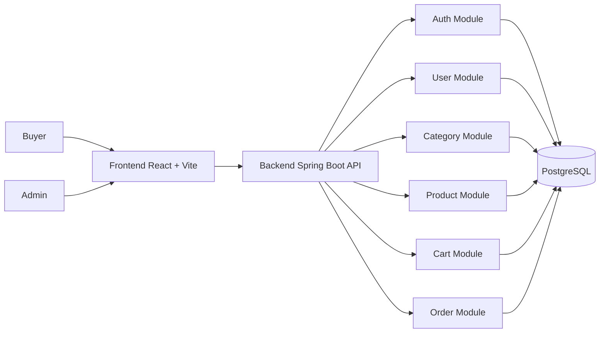
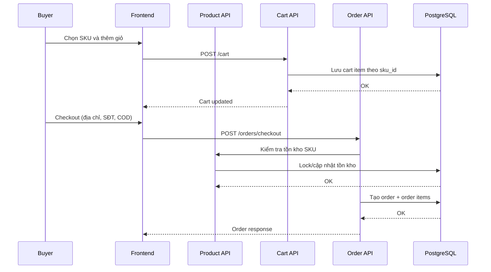

# Ecommerce Platform - Single-vendor E-commerce

Nền tảng thương mại điện tử theo mô hình **single vendor** tương tự một cửa hàng bán lẻ trực tuyến: một chủ hệ thống quản lý danh mục, thương hiệu, sản phẩm, đơn hàng và khách hàng.

README này tập trung vào:
- Kiến trúc hệ thống.
- Cách các module phối hợp với nhau.
- Tech stack đang sử dụng.

## Tổng quan kiến trúc

Hệ thống gồm 2 phần chính:
- **Backend API**: xử lý nghiệp vụ, phân quyền, dữ liệu, giao dịch.
- **Frontend Web**: giao diện customer/admin, gọi API qua HTTP.

### Sơ đồ tổng thể (Mermaid)



### Mô hình kiến trúc backend

Backend tổ chức theo **modular monolith** với các module nghiệp vụ tách biệt, nhưng chạy trong một ứng dụng Spring Boot thống nhất.

```text
src/main/java/com/tuan/ecommerce/modules/
|- auth       # đăng ký/đăng nhập, JWT, refresh token, phân quyền
|- user       # hồ sơ người dùng, quản trị user
|- category   # danh mục sản phẩm
|- product    # sản phẩm, SKU, duyệt sản phẩm
|- cart       # giỏ hàng theo SKU
`- order      # checkout, đơn hàng, trạng thái đơn
```

### Kiến trúc lớp trong mỗi module

Mỗi module backend đi theo hướng tách lớp rõ ràng:
- `api`: controller, nhận/trả HTTP request/response.
- `application`: service và use-case nghiệp vụ.
- `domain`: entity, enum, business model.
- `infrastructure`: repository, mapper, tích hợp persistence.

Mô hình này giúp:
- Tách biệt logic nghiệp vụ và framework.
- Dễ viết test theo tầng.
- Dễ refactor hoặc tách microservice theo module khi cần.

## Luồng kiến trúc chính

### Luồng xác thực

1. Client gửi thông tin đăng nhập qua API auth.
2. Backend xác thực user/role.
3. Cấp `access token` + `refresh token`.
4. Các API nghiệp vụ được bảo vệ bởi Spring Security + JWT filter.

### Luồng mua hàng

1. Buyer discovery sản phẩm và chọn SKU.
2. Thêm SKU vào giỏ (`cart`).
3. Checkout tạo đơn single-vendor (`order`).
4. Cập nhật tồn kho và trạng thái đơn theo luồng nghiệp vụ.

### Luồng admin

- Admin tạo, cập nhật, ẩn sản phẩm/SKU.
- Admin quản lý danh mục, thương hiệu, user và trạng thái đơn hàng.

### Sơ đồ luồng đặt hàng (Mermaid)



## Kiến trúc frontend

Frontend sử dụng React + Vite, tổ chức theo hướng chức năng:

```text
frontend/src/
|- api/         # axios client, gọi backend API
|- components/  # UI dùng lại (vd: Navbar)
|- context/     # trạng thái dùng chung (auth)
|- pages/       # các màn hình theo vai trò/nghiệp vụ
`- assets/      # ảnh và tài nguyên tĩnh
```

Định tuyến theo vai trò và nghiệp vụ chính:
- Buyer: home/discovery, product detail, cart, checkout, orders.
- Admin: admin users, admin products moderation.

## Tech stack

### Backend

- Java 17
- Spring Boot
- Spring Web MVC
- Spring Data JPA
- Spring Security
- JWT (`jjwt`)
- PostgreSQL Driver
- Lombok
- Maven

### Frontend

- React
- Vite
- React Router DOM
- Axios
- Tailwind CSS
- ESLint
- npm

### Database

- PostgreSQL

## Cách chạy dự án

### Yêu cầu môi trường

- JDK 17
- Maven 3.9+
- Node.js 20+
- PostgreSQL 15+

### Cấu hình database

```sql
CREATE DATABASE ecommerce;
```

Cập nhật thông tin kết nối trong `src/main/resources/application.properties` theo máy local.

### Chạy backend

```bash
cd D:\ecommerce-platform\ecommerce-platform
mvn clean install
mvn spring-boot:run
```

Backend mặc định: `http://localhost:8080`

### Chạy frontend

```bash
cd D:\ecommerce-platform\ecommerce-platform\frontend
npm install
npm run dev
```

Frontend mặc định: `http://localhost:5173`

## Build và kiểm thử

### Backend

```bash
cd D:\ecommerce-platform\ecommerce-platform
mvn test
mvn clean package
```

### Frontend

```bash
cd D:\ecommerce-platform\ecommerce-platform\frontend
npm run lint
npm run build
```

## Tài liệu liên quan

- Phân tích thiết kế single-vendor e-commerce: `plans/multi-vendor-architecture.md`
- Tài liệu frontend: `frontend/README.md`
- Cấu hình ứng dụng: `src/main/resources/application.properties`

## Hướng phát triển mở rộng

### 1) Tích hợp RabbitMQ cho xử lý bất đồng bộ

- Tách các tác vụ không cần phản hồi tức thì sang message queue (ví dụ: gửi thông báo, email, đồng bộ trạng thái vận chuyển).
- Chuẩn hóa event contract giữa các module để giảm coupling nội bộ.
- Hỗ trợ retry, dead-letter queue và idempotency cho các consumer quan trọng.

### 2) Lộ trình chuyển sang microservices

- Giai đoạn đầu: giữ modular monolith, tách boundary rõ bằng API nội bộ/event.
- Ưu tiên tách trước các domain có tải cao hoặc vòng đời riêng: `order`, `product`, `notification`.
- Bổ sung API gateway, service discovery và observability trước khi tách diện rộng.

### 3) Saga cho giao dịch phân tán

- Khi tách service, luồng đặt hàng sẽ cần Saga để đảm bảo nhất quán dữ liệu giữa `order`, `inventory`, `payment`.
- Có thể bắt đầu từ **choreography** (event-driven qua RabbitMQ), sau đó cân nhắc **orchestration** khi luồng phức tạp hơn.
- Thiết kế sẵn các bước bù trừ (compensation) như giải phóng giữ kho, hủy đơn chưa xử lý và đánh dấu thanh toán thất bại.

### 4) Mở rộng tiếp theo

- Payment online (VNPay/Stripe) song song với COD.
- Real-time notification (WebSocket/SSE) cho customer/admin.
- Search/recommendation nâng cao (Elasticsearch/OpenSearch) khi dữ liệu tăng.

