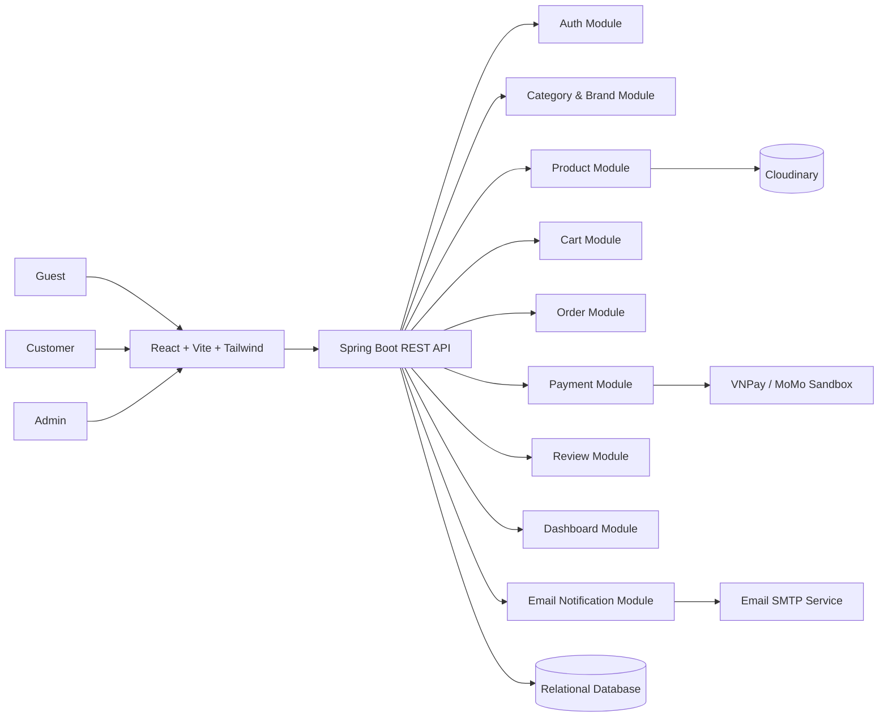
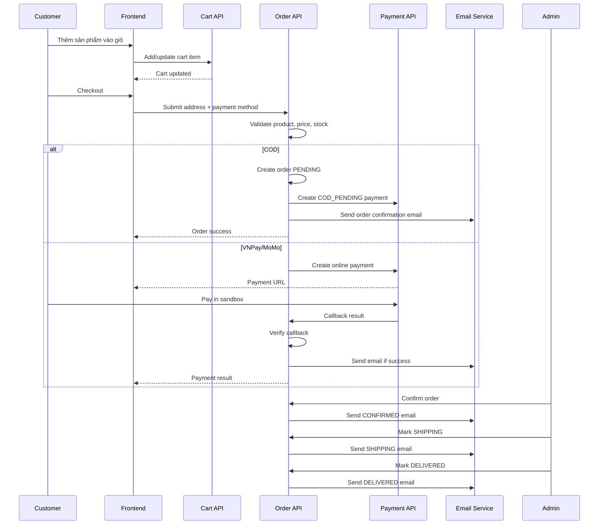

# Phân tích thiết kế hệ thống E-commerce Single Vendor

Tài liệu này mô tả phân tích nghiệp vụ và thiết kế tổng quan cho nền tảng thương mại điện tử **single vendor** theo mô hình tương tự Điện Máy Xanh: một chủ sở hữu hệ thống bán nhiều sản phẩm, nhiều thương hiệu và nhiều danh mục. Nội dung tập trung vào thiết kế hệ thống, không mô tả chi tiết triển khai code.

## 1. Mục tiêu dự án

Dự án hướng đến việc xây dựng một hệ thống e-commerce thực tế ở quy mô vừa, phù hợp để thể hiện năng lực cho vị trí fresher/intern full-stack.

Mục tiêu chính:

- Xây dựng backend bằng Java Spring Boot với phân quyền rõ ràng, xử lý nghiệp vụ mua hàng, đơn hàng, thanh toán và thông báo.
- Xây dựng frontend bằng React + Vite + Tailwind CSS, responsive trên desktop và mobile.
- Mô phỏng quy trình mua hàng thực tế: xem sản phẩm, lọc/tìm kiếm, thêm giỏ, checkout, thanh toán, nhận email, theo dõi đơn hàng và đánh giá sản phẩm.
- Cung cấp trang admin để quản lý danh mục, thương hiệu, sản phẩm, đơn hàng và xem thống kê.

## 2. Phạm vi hệ thống

### 2.1 Trong phạm vi

Hệ thống bao gồm các nhóm chức năng:

- Xác thực và phân quyền bằng JWT.
- Quản lý danh mục sản phẩm đa cấp.
- Quản lý thương hiệu.
- Quản lý sản phẩm, ảnh sản phẩm, tồn kho và thông số kỹ thuật linh hoạt.
- Tìm kiếm, lọc, sắp xếp và phân trang danh sách sản phẩm.
- Giỏ hàng lưu trên server theo tài khoản khách hàng.
- Checkout với COD và thanh toán online qua VNPay hoặc MoMo sandbox.
- Gửi email xác nhận đặt hàng và email cập nhật trạng thái đơn hàng.
- Quản lý đơn hàng cho customer và admin.
- Đánh giá sản phẩm bởi khách hàng đã mua.
- Admin dashboard thống kê doanh thu, đơn hàng, sản phẩm bán chạy và biểu đồ doanh thu.
- Giao diện responsive, có loading skeleton, toast notification, empty state và xử lý lỗi thân thiện.

### 2.2 Ngoài phạm vi

Các chức năng sau không thuộc phạm vi chính của phiên bản này:

- Multi-vendor marketplace, shop riêng cho từng seller, hoa hồng và payout.
- Trả hàng, đổi trả, hoàn tiền nâng cao.
- Mã giảm giá, voucher, flash sale phức tạp.
- Tích hợp vận chuyển thực tế với đơn vị giao hàng.
- Hệ thống kho đa chi nhánh.
- Chat, ticket hỗ trợ khách hàng.
- Recommendation/search engine nâng cao như Elasticsearch.

## 3. Actor và phân quyền

Hệ thống có 2 role chính: `ADMIN` và `CUSTOMER`. Khách chưa đăng nhập được xem sản phẩm nhưng không được thêm giỏ hàng hoặc đặt hàng.

### 3.1 Guest

- Xem trang chủ, danh mục và chi tiết sản phẩm.
- Tìm kiếm, lọc và sắp xếp sản phẩm.
- Đăng ký hoặc đăng nhập tài khoản.

### 3.2 Customer

- Đăng ký, đăng nhập và sử dụng JWT để gọi API bảo vệ.
- Quản lý thông tin cá nhân cơ bản.
- Thêm, cập nhật số lượng hoặc xóa sản phẩm trong giỏ hàng.
- Checkout, chọn địa chỉ giao hàng và phương thức thanh toán.
- Xem lịch sử đơn hàng và trạng thái đơn.
- Hủy đơn khi đơn còn ở trạng thái chờ xác nhận.
- Đánh giá sản phẩm đã mua và đã giao thành công.

### 3.3 Admin

- Quản lý toàn bộ danh mục và thương hiệu.
- Tạo, cập nhật, xóa sản phẩm.
- Upload và quản lý ảnh sản phẩm qua Cloudinary.
- Quản lý giá, tồn kho và thông số kỹ thuật sản phẩm.
- Xem tất cả đơn hàng và cập nhật trạng thái đơn.
- Xem dashboard thống kê doanh thu, trạng thái đơn hàng và sản phẩm bán chạy.

## 4. Kiến trúc tổng quan

Hệ thống được thiết kế theo mô hình frontend/backend tách biệt:

- **Frontend Web**: React + Vite + Tailwind CSS, gọi API qua HTTP.
- **Backend API**: Java Spring Boot, xử lý nghiệp vụ, bảo mật, dữ liệu và tích hợp bên ngoài.
- **Database**: cơ sở dữ liệu quan hệ để lưu user, sản phẩm, giỏ hàng, đơn hàng, thanh toán và review.
- **Cloudinary**: lưu trữ ảnh sản phẩm.
- **Payment Provider**: VNPay hoặc MoMo sandbox để mô phỏng thanh toán online.
- **Email Service**: SMTP hoặc dịch vụ email để gửi thông báo đơn hàng.



## 5. Thiết kế module backend

Backend nên tổ chức theo hướng modular monolith để dễ đọc, dễ test và dễ mở rộng.

```text
modules/
|- auth          # đăng ký, đăng nhập, JWT, role ADMIN/CUSTOMER
|- user          # thông tin người dùng, địa chỉ giao hàng nếu tách riêng
|- category      # danh mục đa cấp
|- brand         # thương hiệu sản phẩm
|- product       # sản phẩm, ảnh, giá, tồn kho, thông số kỹ thuật
|- cart          # giỏ hàng theo customer
|- order         # checkout, đơn hàng, order item, trạng thái đơn
|- payment       # COD, VNPay/MoMo sandbox, callback thanh toán
|- notification  # gửi email xác nhận đơn và cập nhật trạng thái
|- review        # đánh giá sản phẩm
`- dashboard     # thống kê doanh thu, đơn hàng, sản phẩm bán chạy
```

Boundary chính:

- `auth` chịu trách nhiệm xác thực và cấp JWT, không xử lý nghiệp vụ mua hàng.
- `product` là nguồn dữ liệu chính của catalog, giá bán, tồn kho và thông số kỹ thuật.
- `cart` chỉ lưu sản phẩm khách muốn mua, không chốt giá cuối cùng.
- `order` luôn snapshot giá, tên sản phẩm, số lượng và địa chỉ tại thời điểm checkout.
- `payment` xử lý trạng thái thanh toán và callback idempotent từ VNPay/MoMo.
- `notification` gửi email theo sự kiện đặt hàng và thay đổi trạng thái.
- `dashboard` chỉ đọc dữ liệu tổng hợp, không thay đổi nghiệp vụ gốc.

## 6. Thiết kế frontend

Frontend được chia theo nhóm màn hình và vai trò sử dụng.

```text
frontend/src/
|- api/          # axios client, cấu hình token, gọi backend API
|- components/   # component dùng lại: header, product card, modal, table
|- context/      # auth context, cart context nếu cần
|- pages/        # màn hình public, customer và admin
|- routes/       # route public/protected/admin
|- utils/        # format tiền, ngày, validate phụ trợ
`- assets/       # tài nguyên tĩnh
```

Nhóm màn hình chính:

- Public: home, danh sách sản phẩm, chi tiết sản phẩm, đăng nhập, đăng ký.
- Customer: giỏ hàng, checkout, lịch sử đơn hàng, chi tiết đơn hàng, form review.
- Admin: quản lý danh mục, thương hiệu, sản phẩm, đơn hàng, dashboard.

Yêu cầu UI:

- Responsive cho desktop và mobile.
- Có loading skeleton khi tải danh sách hoặc chi tiết.
- Có toast notification cho thao tác thành công/thất bại.
- Có empty state cho giỏ hàng trống, không có đơn hàng, không có kết quả tìm kiếm.
- Có thông báo lỗi rõ ràng khi đăng nhập sai, thanh toán thất bại hoặc sản phẩm hết hàng.

## 7. Mô hình dữ liệu cốt lõi

### 7.1 User

Lưu thông tin tài khoản và phân quyền.

Trường chính:

- `id`
- `full_name`
- `email`
- `password_hash`
- `phone`
- `role`: `ADMIN`, `CUSTOMER`
- `enabled`
- `created_at`, `updated_at`

### 7.2 Category

Danh mục sản phẩm đa cấp, ví dụ: Điện tử -> Điện thoại -> iPhone.

Trường chính:

- `id`
- `name`
- `slug`
- `parent_id`
- `description`
- `active`
- `created_at`, `updated_at`

Quy tắc:

- Một danh mục có thể có nhiều danh mục con.
- Sản phẩm có thể gắn với danh mục cấp cuối hoặc danh mục phù hợp theo thiết kế admin.
- Khi lọc theo danh mục cha, hệ thống nên lấy cả sản phẩm thuộc danh mục con.

### 7.3 Brand

Lưu thông tin thương hiệu như Samsung, LG, Apple.

Trường chính:

- `id`
- `name`
- `slug`
- `logo_url`
- `description`
- `active`
- `created_at`, `updated_at`

### 7.4 Product

Lưu thông tin bán hàng chính của sản phẩm.

Trường chính:

- `id`
- `name`
- `slug`
- `description`
- `base_price`
- `sale_price`
- `stock_quantity`
- `category_id`
- `brand_id`
- `status`
- `average_rating`
- `review_count`
- `created_at`, `updated_at`

Quy tắc:

- `sale_price` nếu có phải nhỏ hơn hoặc bằng `base_price`.
- Chỉ sản phẩm `ACTIVE` và còn tồn kho mới được khách mua.
- Tồn kho phải được kiểm tra lại ở thời điểm checkout, không chỉ lúc thêm giỏ.

### 7.5 ProductImage

Lưu ảnh sản phẩm upload lên Cloudinary.

Trường chính:

- `id`
- `product_id`
- `image_url`
- `cloudinary_public_id`
- `is_primary`
- `sort_order`

Quy tắc:

- Một sản phẩm nên có một ảnh chính.
- Khi xóa ảnh, cần đồng bộ xóa hoặc đánh dấu không dùng trên Cloudinary theo chính sách hệ thống.

### 7.6 ProductSpec

Lưu thông số kỹ thuật linh hoạt theo từng loại sản phẩm.

Có thể thiết kế theo một trong hai hướng:

- Bảng key-value: `product_id`, `spec_key`, `spec_value`, `display_order`.
- JSON column: lưu toàn bộ thông số dưới dạng JSON.

Với dự án fresher/intern, bảng key-value dễ truy vấn, dễ hiển thị và dễ kiểm soát dữ liệu hơn.

Ví dụ:

- Điện thoại: màn hình, chip, RAM, dung lượng, camera, pin.
- Tủ lạnh: dung tích, công nghệ inverter, số cửa, mức tiêu thụ điện.
- Máy giặt: khối lượng giặt, kiểu lồng, công nghệ giặt, tốc độ vắt.

### 7.7 Cart và CartItem

Giỏ hàng lưu trên server và gắn với tài khoản customer.

Trường chính của `cart`:

- `id`
- `customer_id`
- `created_at`, `updated_at`

Trường chính của `cart_item`:

- `id`
- `cart_id`
- `product_id`
- `quantity`
- `created_at`, `updated_at`

Quy tắc:

- Chỉ customer đã đăng nhập mới có giỏ hàng.
- Một sản phẩm chỉ xuất hiện một lần trong giỏ của cùng customer.
- Số lượng trong giỏ không được nhỏ hơn 1.
- Khi hiển thị giỏ, backend cần trả giá và tồn kho mới nhất.

### 7.8 Order và OrderItem

Đơn hàng lưu kết quả checkout đã được xác nhận.

Trường chính của `orders`:

- `id`
- `customer_id`
- `order_code`
- `status`
- `payment_method`
- `payment_status`
- `receiver_name`
- `receiver_phone`
- `shipping_address`
- `subtotal`
- `shipping_fee`
- `discount_total`
- `total_amount`
- `created_at`, `updated_at`

Trường chính của `order_items`:

- `id`
- `order_id`
- `product_id`
- `product_name_snapshot`
- `product_image_snapshot`
- `unit_price_snapshot`
- `quantity`
- `line_total`

Quy tắc:

- Không tính tổng tiền theo dữ liệu frontend gửi lên.
- Order item phải snapshot tên, ảnh, giá và số lượng tại thời điểm đặt hàng.
- Customer chỉ được xem đơn của chính mình.
- Admin được xem toàn bộ đơn hàng.

### 7.9 Payment

Lưu giao dịch thanh toán COD hoặc online.

Trường chính:

- `id`
- `order_id`
- `method`: `COD`, `VNPAY`, `MOMO`
- `status`
- `provider_transaction_id`
- `amount`
- `payment_url`
- `paid_at`
- `created_at`, `updated_at`

Quy tắc:

- COD tạo payment trạng thái `COD_PENDING`.
- VNPay/MoMo tạo payment trạng thái `PENDING`.
- Callback thanh toán phải xử lý idempotent để tránh cập nhật trùng.
- Nếu thanh toán online thất bại hoặc hết hạn, đơn hàng không được chuyển sang bước xử lý.

### 7.10 Review

Lưu đánh giá sản phẩm sau mua hàng.

Trường chính:

- `id`
- `product_id`
- `customer_id`
- `order_item_id`
- `rating`
- `comment`
- `created_at`, `updated_at`

Quy tắc:

- Chỉ customer đã mua sản phẩm và đơn đã `DELIVERED` mới được đánh giá.
- `rating` nằm trong khoảng 1-5.
- Mỗi order item chỉ nên được đánh giá một lần.
- Khi thêm/cập nhật/xóa review, cần cập nhật lại điểm trung bình và số lượng review của sản phẩm.

### 7.11 Notification

Lưu hoặc ghi nhận trạng thái gửi email.

Trường chính:

- `id`
- `user_id`
- `order_id`
- `type`
- `recipient_email`
- `subject`
- `status`
- `sent_at`
- `created_at`

Quy tắc:

- Gửi email xác nhận khi đặt hàng thành công.
- Gửi email khi trạng thái đơn chuyển sang `CONFIRMED`, `SHIPPING`, `DELIVERED`.
- Nếu gửi email thất bại, không được làm hỏng transaction chính của đơn hàng.

## 8. Trạng thái nghiệp vụ

### 8.1 Trạng thái sản phẩm

- `DRAFT`: admin đang tạo, chưa hiển thị.
- `ACTIVE`: đang bán.
- `INACTIVE`: tạm ẩn.
- `OUT_OF_STOCK`: hết hàng.
- `DELETED`: xóa mềm.

Quy tắc:

- Khách chỉ thấy sản phẩm `ACTIVE`.
- Sản phẩm hết tồn kho không được checkout.
- Xóa sản phẩm nên ưu tiên xóa mềm để không ảnh hưởng đơn hàng cũ.

### 8.2 Trạng thái đơn hàng

- `PENDING`: khách đã đặt, chờ admin xác nhận.
- `CONFIRMED`: admin xác nhận đơn.
- `SHIPPING`: đơn đang được giao.
- `DELIVERED`: đơn đã giao thành công.
- `CANCELLED`: đơn đã bị hủy.

Luồng trạng thái chính:

```text
PENDING -> CONFIRMED -> SHIPPING -> DELIVERED
PENDING -> CANCELLED
```

Quy tắc:

- Customer chỉ được hủy đơn khi đơn còn `PENDING`.
- Admin cập nhật trạng thái theo đúng thứ tự nghiệp vụ.
- Không cho chuyển ngược trạng thái, ví dụ `SHIPPING` về `CONFIRMED`.
- Khi đơn chuyển `DELIVERED`, customer được phép đánh giá sản phẩm trong đơn.

### 8.3 Trạng thái thanh toán

- `UNPAID`: chưa thanh toán.
- `COD_PENDING`: chờ thanh toán khi nhận hàng.
- `PENDING`: đang chờ kết quả từ VNPay/MoMo.
- `PAID`: đã thanh toán thành công.
- `FAILED`: thanh toán thất bại.
- `EXPIRED`: giao dịch hết hạn.

Quy tắc:

- COD có thể tạo đơn ngay với order status `PENDING` và payment status `COD_PENDING`.
- Thanh toán online chỉ được xem là thành công khi provider callback hợp lệ.
- Nếu online payment `FAILED` hoặc `EXPIRED`, hệ thống cần thông báo cho khách và không xác nhận đơn.

## 9. Luồng nghiệp vụ chính

### 9.1 Đăng ký và đăng nhập

1. Guest đăng ký tài khoản customer bằng email, mật khẩu và thông tin cơ bản.
2. Backend kiểm tra email không trùng, mã hóa mật khẩu và tạo user role `CUSTOMER`.
3. Customer đăng nhập bằng email/mật khẩu.
4. Backend xác thực và trả JWT.
5. Frontend lưu token và gửi token ở các request cần đăng nhập.

### 9.2 Xem, tìm kiếm và lọc sản phẩm

1. Guest hoặc customer mở danh sách sản phẩm.
2. Frontend gửi các tham số: keyword, category, brand, khoảng giá, sort, page, size.
3. Backend lọc sản phẩm đang `ACTIVE`.
4. Backend trả danh sách phân trang kèm thông tin giá, ảnh chính, thương hiệu, danh mục và rating.
5. Frontend hiển thị skeleton khi loading, empty state nếu không có kết quả.

### 9.3 Admin quản lý sản phẩm

1. Admin tạo sản phẩm với tên, mô tả, giá, tồn kho, danh mục, thương hiệu và thông số kỹ thuật.
2. Admin upload ảnh sản phẩm lên Cloudinary.
3. Backend lưu URL ảnh và public id.
4. Admin cập nhật trạng thái sản phẩm sang `ACTIVE` để hiển thị cho khách.
5. Khi sửa/xóa sản phẩm, hệ thống không làm thay đổi dữ liệu snapshot trong đơn hàng cũ.

### 9.4 Giỏ hàng

1. Customer đăng nhập và bấm thêm sản phẩm vào giỏ.
2. Backend kiểm tra sản phẩm tồn tại, đang bán và số lượng hợp lệ.
3. Nếu sản phẩm đã có trong giỏ, hệ thống cộng hoặc cập nhật số lượng.
4. Customer có thể thay đổi số lượng hoặc xóa item khỏi giỏ.
5. Khi hiển thị giỏ, hệ thống kiểm tra lại giá, trạng thái sản phẩm và tồn kho hiện tại.

### 9.5 Checkout COD

1. Customer chọn sản phẩm trong giỏ và nhập địa chỉ giao hàng.
2. Customer chọn phương thức thanh toán COD.
3. Backend kiểm tra lại toàn bộ item: sản phẩm còn bán, đủ tồn kho, giá hợp lệ.
4. Backend tính subtotal, phí vận chuyển nếu có và total amount.
5. Backend trừ hoặc giữ tồn kho theo chính sách thiết kế.
6. Backend tạo order trạng thái `PENDING`, payment trạng thái `COD_PENDING`.
7. Backend gửi email xác nhận đặt hàng thành công.
8. Frontend hiển thị trang đặt hàng thành công.

### 9.6 Checkout online với VNPay/MoMo sandbox

1. Customer chọn thanh toán online.
2. Backend kiểm tra giỏ hàng, tính tổng tiền và tạo payment trạng thái `PENDING`.
3. Backend tạo URL thanh toán hoặc thông tin thanh toán từ VNPay/MoMo sandbox.
4. Customer thanh toán trên môi trường sandbox.
5. Provider callback về backend.
6. Backend xác thực chữ ký/tham số callback.
7. Nếu thanh toán thành công:
   - Payment chuyển `PAID`.
   - Order được tạo hoặc xác nhận ở trạng thái `PENDING`.
   - Hệ thống gửi email xác nhận.
8. Nếu thanh toán thất bại hoặc hết hạn:
   - Payment chuyển `FAILED` hoặc `EXPIRED`.
   - Hệ thống giải phóng tồn kho nếu đã giữ.
   - Frontend hiển thị thông báo thanh toán thất bại.

Ghi chú thiết kế:

- Có thể tạo order trước khi redirect thanh toán với trạng thái chờ thanh toán, hoặc chỉ tạo order sau khi thanh toán thành công.
- Với dự án này, cách dễ kiểm soát hơn là tạo order nháp/chờ thanh toán, sau callback thành công mới chuyển sang `PENDING`.

### 9.7 Admin xử lý đơn hàng

1. Admin xem danh sách tất cả đơn hàng.
2. Admin lọc theo trạng thái, ngày đặt, customer hoặc mã đơn.
3. Admin mở chi tiết đơn để kiểm tra thông tin khách hàng, địa chỉ và danh sách sản phẩm.
4. Admin cập nhật trạng thái:
   - `PENDING` -> `CONFIRMED`
   - `CONFIRMED` -> `SHIPPING`
   - `SHIPPING` -> `DELIVERED`
5. Mỗi lần trạng thái thay đổi, hệ thống gửi email thông báo cho customer.

### 9.8 Customer theo dõi và hủy đơn

1. Customer mở lịch sử đơn hàng.
2. Backend chỉ trả các đơn thuộc customer hiện tại.
3. Customer xem chi tiết từng đơn và trạng thái hiện tại.
4. Nếu đơn còn `PENDING`, customer có thể hủy.
5. Khi hủy:
   - Order chuyển `CANCELLED`.
   - Tồn kho được hoàn lại nếu đã trừ.
   - Hệ thống gửi email hoặc toast thông báo hủy thành công.

### 9.9 Đánh giá sản phẩm

1. Customer mở đơn hàng đã `DELIVERED`.
2. Với sản phẩm chưa được đánh giá, frontend hiển thị form rating và nhận xét.
3. Backend kiểm tra customer có quyền đánh giá order item đó.
4. Backend lưu review và cập nhật điểm trung bình của sản phẩm.
5. Trang chi tiết sản phẩm hiển thị average rating và danh sách review.

### 9.10 Admin dashboard

Dashboard lấy dữ liệu tổng hợp từ đơn hàng và order item.

Chỉ số chính:

- Tổng doanh thu từ các đơn `DELIVERED`.
- Tổng số đơn hàng.
- Số lượng đơn theo trạng thái.
- Top sản phẩm bán chạy theo số lượng bán.
- Biểu đồ doanh thu theo ngày/tháng.

Quy tắc:

- Doanh thu nên chỉ tính các đơn đã giao thành công.
- Đơn `CANCELLED` không được tính vào doanh thu.
- Dashboard chỉ dành cho role `ADMIN`.

## 10. Sơ đồ luồng đặt hàng



## 11. API thiết kế ở mức tổng quan

Danh sách endpoint chỉ mang tính phân tích thiết kế, không ràng buộc chi tiết triển khai.

### 11.1 Auth

- `POST /api/auth/register`: đăng ký customer.
- `POST /api/auth/login`: đăng nhập và nhận JWT.
- `GET /api/auth/me`: lấy thông tin user hiện tại.

### 11.2 Category và Brand

- `GET /api/categories`: lấy cây danh mục.
- `POST /api/admin/categories`: admin tạo danh mục.
- `PUT /api/admin/categories/{id}`: admin cập nhật danh mục.
- `DELETE /api/admin/categories/{id}`: admin xóa hoặc ẩn danh mục.
- `GET /api/brands`: lấy danh sách thương hiệu.
- `POST /api/admin/brands`: admin tạo thương hiệu.
- `PUT /api/admin/brands/{id}`: admin cập nhật thương hiệu.
- `DELETE /api/admin/brands/{id}`: admin xóa hoặc ẩn thương hiệu.

### 11.3 Product

- `GET /api/products`: tìm kiếm, lọc, sắp xếp, phân trang.
- `GET /api/products/{slug}`: xem chi tiết sản phẩm.
- `POST /api/admin/products`: admin tạo sản phẩm.
- `PUT /api/admin/products/{id}`: admin cập nhật sản phẩm.
- `DELETE /api/admin/products/{id}`: admin xóa mềm sản phẩm.
- `POST /api/admin/products/{id}/images`: upload ảnh sản phẩm.

### 11.4 Cart

- `GET /api/cart`: xem giỏ hàng hiện tại.
- `POST /api/cart/items`: thêm sản phẩm vào giỏ.
- `PUT /api/cart/items/{id}`: cập nhật số lượng.
- `DELETE /api/cart/items/{id}`: xóa item khỏi giỏ.

### 11.5 Order và Payment

- `POST /api/orders/checkout`: tạo checkout COD hoặc online.
- `GET /api/orders/my`: customer xem lịch sử đơn hàng.
- `GET /api/orders/{id}`: customer xem chi tiết đơn của mình.
- `POST /api/orders/{id}/cancel`: customer hủy đơn khi còn `PENDING`.
- `GET /api/admin/orders`: admin xem tất cả đơn.
- `PUT /api/admin/orders/{id}/status`: admin cập nhật trạng thái đơn.
- `GET /api/payments/vnpay/callback`: callback VNPay.
- `POST /api/payments/momo/callback`: callback MoMo.

### 11.6 Review và Dashboard

- `GET /api/products/{id}/reviews`: xem review của sản phẩm.
- `POST /api/products/{id}/reviews`: customer đánh giá sản phẩm đã mua.
- `GET /api/admin/dashboard/summary`: thống kê tổng quan.
- `GET /api/admin/dashboard/revenue`: dữ liệu biểu đồ doanh thu.
- `GET /api/admin/dashboard/top-products`: top sản phẩm bán chạy.

## 12. Quy tắc bảo mật và kiểm soát dữ liệu

- Mật khẩu phải được hash, không lưu plain text.
- JWT phải có thời hạn hiệu lực hợp lý.
- API admin bắt buộc role `ADMIN`.
- API giỏ hàng, checkout, lịch sử đơn và review bắt buộc role `CUSTOMER`.
- Backend không tin giá, tổng tiền hoặc role từ frontend.
- Mọi request tạo/sửa dữ liệu cần validate input.
- Upload ảnh cần kiểm tra loại file, kích thước và xử lý lỗi từ Cloudinary.
- Payment callback cần xác thực chữ ký hoặc checksum theo tài liệu provider.
- Customer không được xem hoặc thao tác đơn hàng của customer khác.
- Review phải kiểm tra quyền dựa trên đơn hàng đã mua, không chỉ dựa trên product id.

## 13. Quy tắc nhất quán nghiệp vụ

- Giá và tồn kho phải được kiểm tra lại ở bước checkout.
- Order item phải lưu snapshot dữ liệu sản phẩm để đơn hàng cũ không bị thay đổi khi admin sửa sản phẩm.
- Khi hủy đơn, tồn kho phải được hoàn lại nếu hệ thống đã trừ tồn kho.
- Callback thanh toán online phải idempotent.
- Email thất bại không được làm rollback đơn hàng đã tạo thành công.
- Dashboard phải loại trừ đơn đã hủy khỏi doanh thu.
- Sản phẩm bị xóa mềm vẫn phải hiển thị đúng trong đơn hàng cũ qua dữ liệu snapshot.

## 14. Tiêu chí hoàn thành chức năng

### 14.1 Customer

- Đăng ký, đăng nhập và đăng xuất được.
- Xem danh sách sản phẩm có lọc, tìm kiếm, sắp xếp và phân trang.
- Xem chi tiết sản phẩm, thông số kỹ thuật và review.
- Thêm sản phẩm vào giỏ sau khi đăng nhập.
- Cập nhật/xóa sản phẩm trong giỏ.
- Checkout bằng COD thành công.
- Checkout online sandbox thành công hoặc thất bại có xử lý rõ ràng.
- Nhận email xác nhận sau khi đặt hàng thành công.
- Xem lịch sử đơn và hủy đơn khi còn `PENDING`.
- Đánh giá sản phẩm đã mua sau khi đơn `DELIVERED`.

### 14.2 Admin

- Quản lý danh mục đa cấp.
- Quản lý thương hiệu.
- Tạo, sửa, xóa mềm sản phẩm.
- Upload ảnh sản phẩm lên Cloudinary.
- Quản lý giá, tồn kho và thông số kỹ thuật.
- Xem và cập nhật trạng thái đơn hàng theo đúng luồng.
- Xem dashboard doanh thu, trạng thái đơn và top sản phẩm bán chạy.

### 14.3 Giao diện

- Hoạt động tốt trên desktop và mobile.
- Có skeleton khi tải dữ liệu.
- Có toast cho thao tác thành công/thất bại.
- Có empty state cho dữ liệu rỗng.
- Có thông báo lỗi dễ hiểu thay vì lỗi kỹ thuật thô.

## 15. Lộ trình ưu tiên triển khai

### Giai đoạn 1: Nền tảng mua hàng cơ bản

- Auth JWT với role `ADMIN`, `CUSTOMER`.
- Category, brand, product CRUD cho admin.
- Public product listing, product detail, filter, sort, pagination.
- Cart server-side cho customer.
- Checkout COD.
- Customer order history.
- Admin order management.

### Giai đoạn 2: Tích hợp thực tế

- Upload ảnh sản phẩm qua Cloudinary.
- Thanh toán VNPay hoặc MoMo sandbox.
- Email xác nhận đơn hàng và cập nhật trạng thái.
- Review sản phẩm sau mua hàng.

### Giai đoạn 3: Hoàn thiện trải nghiệm và dashboard

- Admin dashboard doanh thu, đơn hàng, top sản phẩm.
- Loading skeleton, toast, empty state, error state.
- Tối ưu responsive mobile.
- Bổ sung test cho các luồng nghiệp vụ quan trọng.

## 16. Kết luận

Thiết kế phù hợp nhất cho dự án là single-vendor e-commerce với backend Spring Boot và frontend React. Hệ thống không cần shop/seller hay logic marketplace, mà tập trung vào trải nghiệm mua hàng hoàn chỉnh:

```text
Product discovery
-> Cart
-> Checkout
-> COD or VNPay/MoMo sandbox payment
-> Order management
-> Email notification
-> Delivery status
-> Product review
-> Admin dashboard
```

Phạm vi này đủ thực tế để thể hiện năng lực full-stack, đồng thời không mở rộng quá mức sang các bài toán marketplace phức tạp như hoa hồng, payout, tranh chấp hoặc nhiều người bán.
